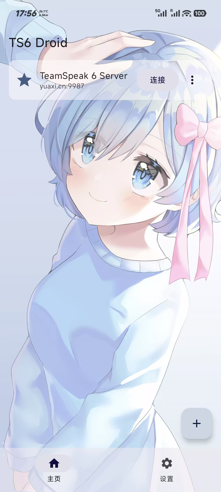
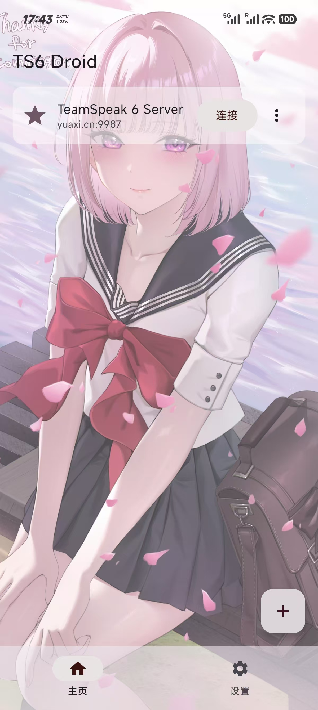
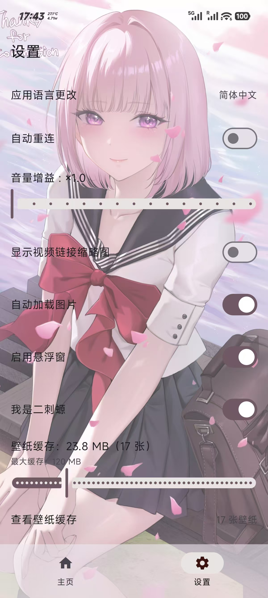
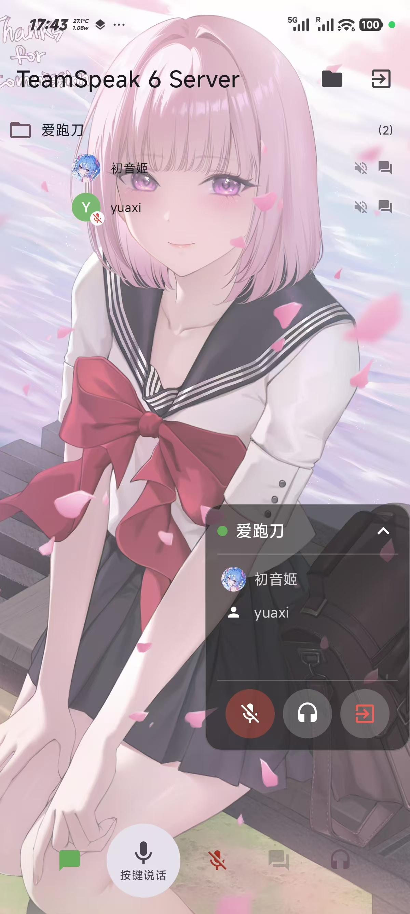

# TS6 Droid 简中版

🍴 **CuNeCl/TS6_Droid_CN** — 基于 [flamme-demon/TS6_Droid](https://github.com/flamme-demon/TS6_Droid) 开源项目二次开发，集成汉化、功能增强与稳定性优化的 TeamSpeak Android 客户端。

这是一个自由、轻量级的 TeamSpeak 3/6 安卓客户端，使用 Jetpack Compose 构建，底层由 Rust 编写的 `tslib` 驱动。

---

## 项目演示

<table>
  <tr>
    <td align="center"></td>
    <td align="center"></td>
  </tr>
  <tr>
    <td align="center"></td>
    <td align="center"></td>
  </tr>
</table>

相较于原版，本项目进行了以下关键优化：

1. ✅ **简体中文本地化** — 100% 补齐全文本简体中文翻译（`zh-rCN`）
2. ✅ **语言切换** — 支持中文、English、Français 一键切换
3. ✅ **内置核心语音驱动** — 直接内置全架构 jniLibs，开箱即用
4. ✅ **DNS SRV 自动解析** — 支持 TeamSpeak SRV 记录发现，输入裸域名自动连接
5. ✅ **连接可靠性增强** — 修复静默崩溃，正确显示网络错误信息
6. ✅ **Nickname 冲突自动重试** — 昵称被占用时自动后缀重试
7. ✅ **云编译 CI/CD 优化** — 适配 AndroidX/Jetifier，优化 Gradle JVM 内存

---

## 更新日志

### v2.0.5-UncleC（2026-06-27）

- 移除动漫壁纸/壁纸缓存系统（不需要的功能）
- 同步上游 v2.0.0-Han ~ v2.0.5-Han 全部更新
- DNS SRV 自动解析保留
- 版本号: 2.0.5-UncleC

### v2.0.5-Han（2026-06-27）

**功能修复**
- 修复音量增益滑块调节后不生效的问题，新增 Flow 观察者实时同步到音频桥
- 麦克风降噪实现验证：使用 Android 原生 NoiseSuppressor API，补全日志帮助排查设备兼容性
- Logo 背景色从蓝色更换为粉色（#2962FF → #FF69B4）
- 修复应用内版本检测无法检测到新版的问题：版本号比较前清除 `-Han` 后缀，API 失败时显示错误信息而非误判为「已是最新」
- 修复 GitHub API 在国内网络环境下不可用时长显「已是最新」的问题

**新功能**
- 应用内版本检测：设置页点击版本号可查询 GitHub 最新 Release 并弹窗更新
- 网络错误时显示具体错误信息，无更新时提示「已是最新版本」
- Release 未上传 APK 时自动回退跳转至 GitHub Releases 页面

### v2.0.1-Han（2026-06-26）

**Compose 性能优化**
- 全项目 54 处 Flow 采集从 `collectAsState` 迁移至 `collectAsStateWithLifecycle`，应用切后台时自动暂停 UI 采集，降低 CPU 占用和电量消耗

**Bug 修复**
- 设置页音量增益滑块可正常调节
- 设置页开关切换页面时不再跳动闪烁
- 文件管理器点击图片文件支持应用内全屏预览

### v2.0.0-Han（2026-06-26）

**Material3 UI 全面重构**
- 采用 Google Material Design 3 规范，完全重构配色、排版与组件样式
- Dynamic Color 动态取色（Android 12+）
- 15 级排版体系，Shape 圆角 token 对齐 M3 标准
- 所有组件（按钮、输入框、卡片、弹窗、底部栏）统一 M3 风格

**启动页与主题自适应**
- 新增 SplashScreen 启动界面，加载期间显示品牌标识

**底部导航栏 + 设置页**
- 首页新增底部导航栏（主页 + 设置），支持页面切换
- 语言切换、自动重连、音量增益、悬浮窗、麦克风降噪、关于软件全部整合到设置页
- 服务端不再显示设置弹窗，界面更简洁

**文件管理器图片预览**
- 点击图片文件直接在应用内全屏预览，不再弹出外部打开方式

**Bug 修复**
- 修复 Config#HARDWARE bitmap 无法 getPixel 导致闪退
- 修复设置页开关在页面切换时跳动闪烁
- 修复 SettingsDialog 残留代码导致编译错误
- 修复窗口背景色导致的灰色底色问题
- 统一所有组件使用 M3 颜色 token

---

## 汉化及增强特性

1. ✅ **简体中文本地化** — 100% 补齐全文本简体中文翻译（`zh-rCN`）
2. ✅ **语言切换** — 支持中文、English、Français 一键切换
3. ✅ **内置核心语音驱动** — 直接内置全架构 jniLibs，开箱即用
4. ✅ **DNS SRV 自动解析** — 支持 TeamSpeak SRV 记录发现，输入裸域名自动连接
5. ✅ **连接可靠性增强** — 修复静默崩溃，正确显示网络错误信息
6. ✅ **Nickname 冲突自动重试** — 昵称被占用时自动后缀重试
7. ✅ **云编译 CI/CD 优化** — 适配 AndroidX/Jetifier，优化 Gradle JVM 内存

---

## 如何进行云编译 (GitHub Actions)

1. **Star/收藏本仓库** 关注更新。
2. 进入仓库页面，点击顶部的 **Actions** 标签，点击绿色按钮激活 Actions。
3. 每次代码推送或手动触发工作流，GitHub 自动打包。
4. 编译完成后，在 **Assets** 区域下载 `app-debug.apk`。

---

## 技术架构与配置

关于底层 Rust 架构、本地编译环境搭建等技术细节，请参考原作者仓库：

[flamme-demon/TS6_Droid](https://github.com/flamme-demon/TS6_Droid)

## 开源许可

本项目遵循 GNU GPLv3 开源许可证。详见 [LICENSE](LICENSE) 文件。

---

## 贡献者

感谢所有为本项目做出贡献的开发者！本分支由 **CuNeCl** 维护。

